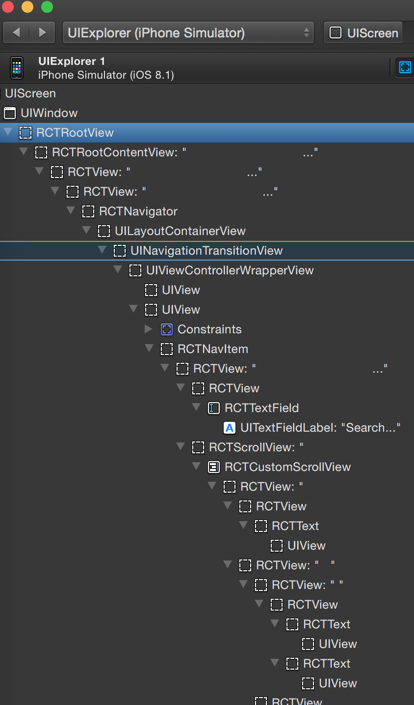
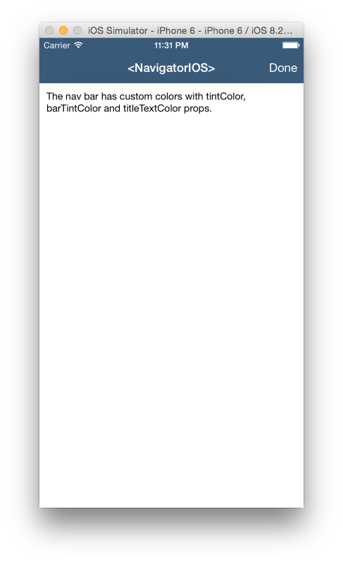
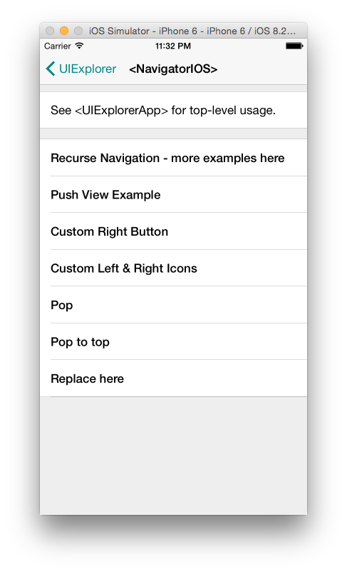
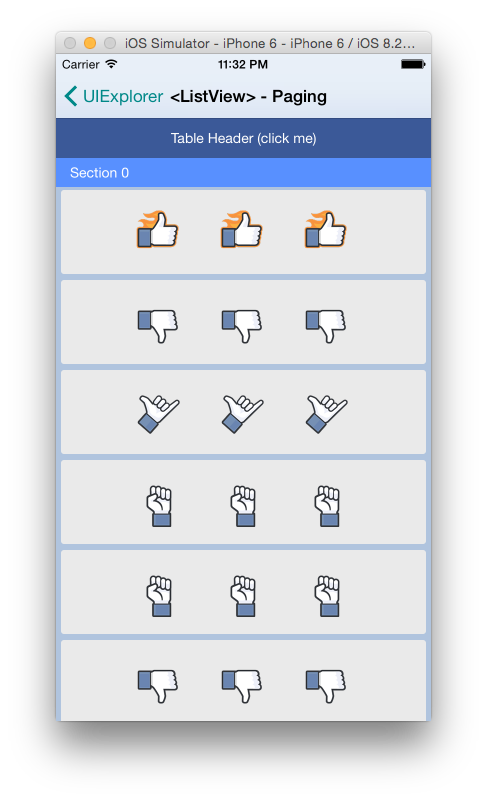
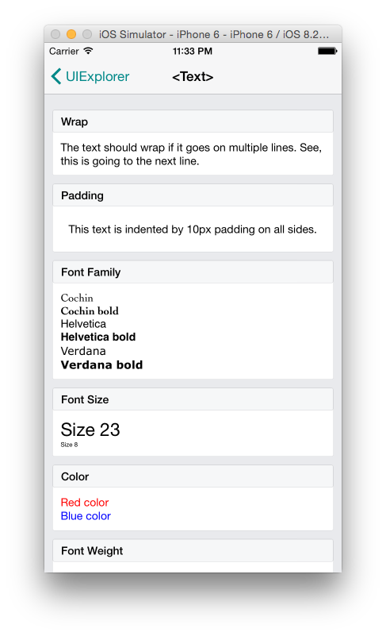
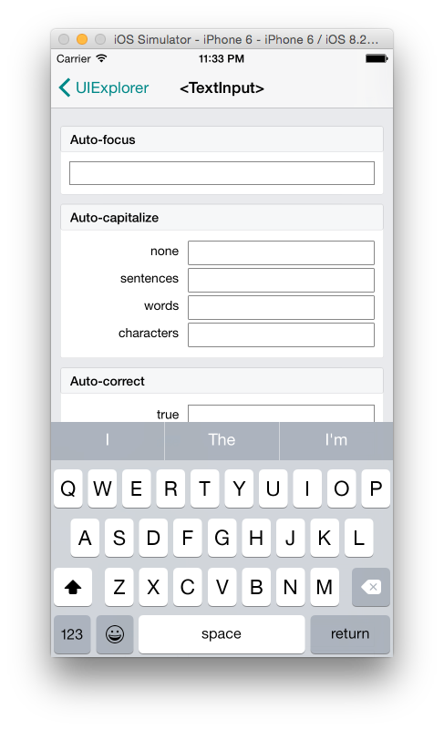
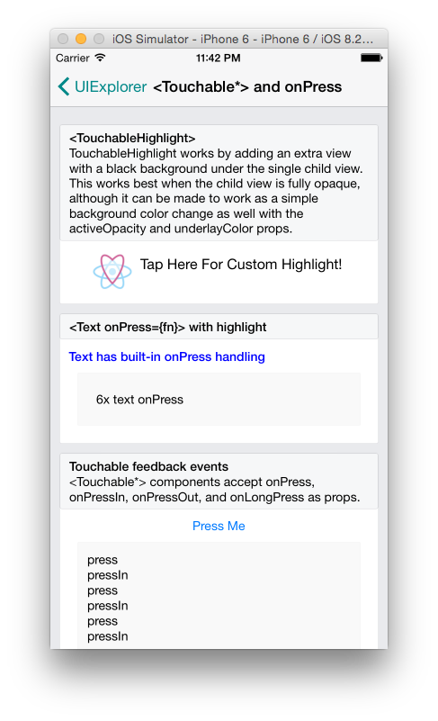

# React Native
### One of these things is not like the others

---

#️始める

---

### "React Native enables you to build world-class application experiences on native platforms using a consistent developer experience based on JavaScript and React. The focus of React Native is on developer efficiency across all the platforms you care about — learn once, write anywhere. Facebook uses React Native in multiple production apps and will continue investing in React Native."

---

# PSA: You don't work for Facebook

---

### "React introduces a novel, radical and highly functional approach to constructing user interfaces. In brief, the application UI is simply expressed as a function of the current application state." - Colin Eberhardt

---

## Getting Started

* brew install nvm
* brew install watchman
* nvm install iojs-v2.0.1 (or whatever is the latest)
* npm install -g react-native-cli
* react-native init AwesomeProject

---

## What does it give you?

1. A new xcode project
1. A working index.ios.js file (that's the react part)

---

## Running the app

* open new_project.xcodeproj
* npm start
* Build and Run within xcode

---

## How is my code run

```objectivec
  jsCodeLocation = [NSURL URLWithString:@"http://localhost:8081/index.ios.bundle"];
```

```objectivec
  RCTRootView *rootView = [[RCTRootView alloc] initWithBundleURL:jsCodeLocation
                                                      moduleName:@"TestProject"
                                                      launchOptions:launchOptions];
```

---

## On the device

* Provisioning Profiles
* Live refresh

```bash
curl 'http://localhost:8081/index.ios.bundle?dev=false&minify=true' -o iOS/main.jsbundle
```

```objectivec
jsCodeLocation = [[NSBundle mainBundle] URLForResource:@"main" withExtension:@"jsbundle"];
```

---

## What does that mean

* You can host your app on a webserver
* When you submit your app, the .bundle has to be part of the app bundle

---

# Some basic parts

---

## ES6

```javascript
class NavButton extends React.Component {
  render() {
    return (
      <TouchableHighlight
        style={styles.button}
        underlayColor="#B5B5B5"
        onPress={this.props.onPress}>
        <Text style={styles.buttonText}>{this.props.text}</Text>
      </TouchableHighlight>
    );
  }
}
```
---

### this slide deliberately left undefined

---

## UINavigationController

---

## Navigation

```javascript
render: function() {
  return (
    <NavigatorIOS
      initialRoute={{
        component: MyView,
        title: 'My View Title',
        passProps: { myProp: 'foo' },
      }}
    />
  );
},
```
---




---

## UITableViewController

---

## TableView



```javascript
render: function() {
  return (
    <ListView
      dataSource={this.state.dataSource}
      renderRow={(rowData) => <Text>{rowData}</Text>}
    />
  );
},
```

---

## UITextView

---

## Text View

```javascript
var WithLabel = React.createClass({
  render: function() {
    return (
      <View style={styles.labelContainer}>
        <View style={styles.label}>
          <Text>{this.props.label}</Text>
        </View>
        {this.props.children}
      </View>
    );
  }
});
```



---

## Text Input

```javascript
render: function() {
    return (
      <View>
        <TextInput
          autoCapitalize="none"
          placeholder="Enter text to see events"
          autoCorrect={false}
          onFocus={() => this.updateText('onFocus')}
          onBlur={() => this.updateText('onBlur')}
          onChange={(event) => this.updateText(
            'onChange text: ' + event.nativeEvent.text
          )}
          onEndEditing={(event) => this.updateText(
            'onEndEditing text: ' + event.nativeEvent.text
          )}
          onSubmitEditing={(event) => this.updateText(
            'onSubmitEditing text: ' + event.nativeEvent.text
          )}
          style={styles.default}
        />
        <Text style={styles.eventLabel}>
          {this.state.curText}{'\n'}
          (prev: {this.state.prevText})
        </Text>
      </View>
    );
}
```



---

## UITapGestureRecognizer / UIButton / didSelectRow / didSelectCell

---

## Touchable Highlight
```javascript
renderButton: function() {
  return (
    <TouchableHighlight onPress={this._onPressButton}>
      <Image
        style={styles.button}
        source={require('image!myButton')}
      />
    </TouchableHighlight>
  );
},
```



---

## Animations

```javascript
animateViewLayout: function() {
    LayoutAnimation.configureNext(
      LayoutAnimation.Presets.spring,
      () => {
        console.log('layout animation done.');
        this.addWrapText();
      },
      (error) => { throw new Error(JSON.stringify(error)); }
    );
    this.setState({
      viewStyle: {
        margin: this.state.viewStyle.margin > 20 ? 20 : 60,
      }
    });
}
```
---

## Polyfills

### "So there's this thing on the web we want you to use"

* Flexbox
* Geolocation
* Network
* Timers

---

## Testing (here be dragons)

* Jest (http://facebook.github.io/jest/)
* Integration Tests
* Snapshot Tests

---

## The test runner

```objectivec
RCTTestRunner *_runner;
_runner = RCTInitRunnerForApp(@"Examples/UIExplorer/UIExplorerApp");
```

---

## Snapshots

```objectivec
[_runner runTest:_cmd module:@"NavigatorIOSExample"];
```

---

## Integration Tests

### For when you need JS and Native

---

# Styling it up
### Flexbox vs Storyboards / Auto Layout

---

# Flexbox

* 320 all the things
* Flow

---

# Storyboards / Auto Layout

* ???

---

### There's not that great really

---

## Image assets

* Yes, it uses the asset catalogue.

```
<Image source={require('image!house')} style={styles.image}/>
```

---

## Resources

* React Rocks (http://react.rocks/)
* ReactNative.com
* http://www.raywenderlich.com/99473/introducing-react-native-building-apps-javascript
* https://github.com/facebook/react-native/tree/master/Examples/UIExplorer

---

#　質問がありますか
## (any questions)

---

#　終わりだ
